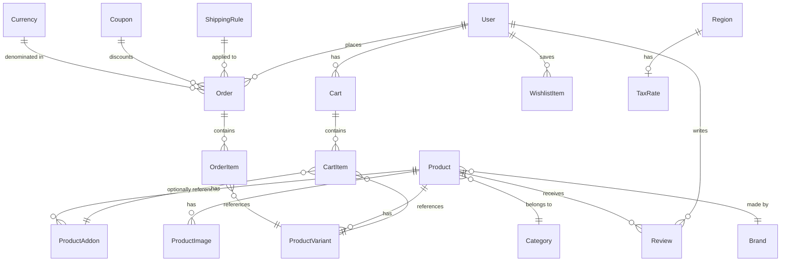

# 🌌 AUSSIE RIGS ARENA — RC Store Ultra

[](https://nextjs.org/)
[](https://react.dev/)
[](https://www.typescriptlang.org/)
[](https://tailwindcss.com/)
[](https://www.prisma.io/)
[](https://www.postgresql.org/)
[](https://supabase.com/)
[](https://stripe.com/)
[](https://rc-store.vercel.app)

**AUSSIE RIGS ARENA** is a production-grade, ultra-premium full-stack e-commerce platform for remote control cars, built on Next.js 14 App Router. It features real Stripe payment processing, transactional email pipelines, dynamic tax & shipping rule engines, multi-currency support, faceted product search, per-user cart isolation, rich SEO structured data, and a comprehensive Admin Dashboard.

> 🔗 **Live Production:** [rc-store.vercel.app](https://rc-store.vercel.app)

---

## 📖 Table of Contents

- [🛠️ Core Technology Stack](#️-core-technology-stack)
- [🏗️ Project Architecture](#️-project-architecture)
- [✨ Feature Breakdown](#-feature-breakdown)
  - [Storefront & Shopping](#storefront--shopping)
  - [Cart & Checkout](#cart--checkout)
  - [Payments (Stripe)](#payments-stripe)
  - [Transactional Emails](#transactional-emails)
  - [Multi-Currency Support](#multi-currency-support)
  - [Advanced Search & Filtering](#advanced-search--filtering)
  - [Tax & Shipping Rules Engine](#tax--shipping-rules-engine)
  - [Admin Dashboard](#admin-dashboard)
  - [SEO & Rich Metadata](#seo--rich-metadata)
- [🗄️ Database & Schema](#️-database--schema)
- [🚀 Installation & Local Setup](#-installation--local-setup)
- [🔑 Demo Accounts](#-demo-accounts)

---

## 🛠️ Core Technology Stack

| Category | Technology | Purpose |
| :--- | :--- | :--- |
| **Framework** | Next.js 14.2.16 (App Router) | SSR, ISR, Server Actions, API routes |
| **UI** | Radix UI + shadcn/ui + Tailwind CSS | Accessible, themeable component primitives |
| **State** | Zustand (persisted) | Per-user cart isolation with server sync |
| **Auth** | NextAuth.js v4 | JWT sessions, role-based access (SUPER_ADMIN / ADMIN / STAFF / CUSTOMER) |
| **Database** | Prisma ORM + Supabase PostgreSQL 16 | Type-safe queries, migrations, relations |
| **Payments** | Stripe Checkout + Webhooks | Idempotent order creation via webhook table |
| **Email** | Resend + React Email | Branded transactional HTML emails |
| **Queue** | BullMQ (Redis) | Background job processing (abandoned cart cron) |
| **Search** | Lodash debounce + Prisma full-text | Instant debounced product/category/brand search |
| **Charts** | Recharts | Admin revenue & analytics dashboards |
| **Validation** | Zod | Runtime schema validation on all forms & actions |
| **SEO** | Next.js Metadata API + JSON-LD | Dynamic OpenGraph tags + schema.org structured data |

---

## 🏗️ Project Architecture

```
rc-store/
├── prisma/
│   └── schema.prisma          # 40+ models: Products, Orders, Cart, Tax, Shipping, Currencies…
├── src/
│   ├── actions/               # Server Actions (auth, cart, tax, shipping, orders, coupons…)
│   ├── app/
│   │   ├── (storefront)/      # Public-facing pages
│   │   │   ├── page.tsx       # Home – Hero, Featured, Best Sellers, New Releases
│   │   │   ├── products/      # Catalog + [slug] product detail with JSON-LD
│   │   │   ├── cart/          # Cart page with stepper + addon modal
│   │   │   └── checkout/      # Secure checkout with Stripe redirect
│   │   ├── admin/             # Admin Dashboard (role-gated)
│   │   │   ├── products/      # CRUD product management + image uploads
│   │   │   ├── orders/        # Order management + status updates + shipping labels
│   │   │   ├── coupons/       # Coupon code management
│   │   │   ├── inventory/     # Variant-level stock control
│   │   │   └── settings/
│   │   │       ├── tax/       # Adjustable tax rates per region
│   │   │       └── shipping/  # Shipping rule builder (min/max order amount)
│   │   ├── customer/          # Customer self-service dashboard
│   │   └── api/               # REST API routes (webhooks, admin, cron)
│   ├── components/
│   │   ├── layout/            # Header (with cart sync), Footer, Currency Switcher, GlobalSearch
│   │   ├── cart/              # CheckoutStepper, CartAddonModal
│   │   ├── product/           # ProductCard, AddToCartButton, ProductBreadcrumb
│   │   ├── emails/            # React Email templates (OrderConfirmation, Shipped, AbandonedCart)
│   │   └── ui/                # shadcn/ui primitives
│   ├── store/
│   │   └── cart.ts            # Zustand cart store with syncWithServer() + clearCart()
│   ├── hooks/                 # usePrice (multi-currency), useCurrency
│   ├── notifications/         # Event-driven notification pipeline (Email + BullMQ strategies)
│   └── lib/                   # db.ts, server-api.ts, bootstrap.ts
```

---

## ✨ Feature Breakdown

### Storefront & Shopping

- **Dynamic Home Page** — Hero slider, Featured Product, Trust Highlights, Shop Categories, Best Sellers tabs, Brand Showcase, Part Finder Banner, Staff Picks, New Releases, Customer Gallery, Newsletter section, SEO content block.
- **Product Catalog** (`/products`) — ISR (60s revalidation), faceted sidebar filters (size, color, category, price range), sort options (newest / price asc/desc / best sellers), pagination.
- **Product Detail** (`/products/[slug]`) — ISR (5 min), variant picker (size/color), stock validation, add-to-cart, add-to-wishlist, reviews, product Q&A, related products.
- **Wishlist** — Persistent per-user wishlist with move-to-cart support.
- **Collections** — Curated marketing collections (New Arrivals, etc.)

### Cart & Checkout

- **Per-User Cart Isolation** — Cart state is backed by the database. On login, `syncWithServer()` fetches the user's real DB cart and replaces local Zustand state. On logout, `clearCart()` wipes local storage so no data leaks between accounts.
- **Guest Cart** — Anonymous shoppers get a `guestSessionId`. On sign-in, guest items are merged into the user's account cart via `mergeGuestCart()`.
- **Checkout Stepper** — Three-step visual progress indicator (Shopping Bag → Shipping Details → Secure Payment) with clickable navigation between completed steps.
- **Addon Modal** — In-cart addon upsell modal with full detail view and add-to-cart.
- **Coupon Codes** — Validated server-side against the `Coupon` table with usage limits and expiry.
- **Dynamic Tax & Shipping** — Calculated live from the Rules Engine (see below).

### Payments (Stripe)

- Stripe Checkout Session created from cart contents + applied coupon discount.
- Idempotent webhook handler (`/api/webhooks/stripe`) uses a `WebhookEvent` deduplication table to prevent duplicate order creation on retry.
- Post-payment: order created, inventory decremented, loyalty points awarded, confirmation email dispatched.

### Transactional Emails

Built with **React Email** + **Resend**:

| Email | Trigger |
|---|---|
| **Order Confirmation** | Stripe `checkout.session.completed` webhook |
| **Order Shipped** | Admin marks order as `SHIPPED` in dashboard |
| **Abandoned Cart Recovery** | Cron job (`/api/cron/abandoned-carts`) runs every 24h; sends reminder with a 5% discount code to logged-in users who left items in cart |

### Multi-Currency Support

- Admin can create `Currency` records with an `exchangeRate` relative to the base currency (AUD).
- A **Currency Switcher** dropdown in the Navbar lets shoppers select their preferred currency.
- All prices across the storefront multiply through the selected exchange rate in real-time via the `usePrice()` hook.

### Advanced Search & Filtering

- **Global Search** — Debounced header search bar with live product suggestion cards (name, image, price) and keyboard navigation.
- **Faceted Sidebar** — `/products` sidebar supports multi-select sizes, colors, categories, and a price range slider — all synced to URL params for shareable links.
- **Sort** — Newest, Price Low→High, Price High→Low, Best Sellers.

### Tax & Shipping Rules Engine

#### Tax Rates (`/admin/settings/tax`)
- Tax rates are stored in the `TaxRate` model linked to `Region`.
- Admins can adjust the rate (decimal) and toggle active status per region.
- Checkout fetches the applicable rate via `getTaxRateByRegionCode()`.

#### Shipping Rules (`/admin/settings/shipping`)
- Admin creates rules with **name**, **min order amount**, **max order amount**, and **shipping cost**.
- `calculateShippingCost(subtotal)` evaluates all active rules in descending min-amount order and returns the first matching rule's fee.
- Default fallback: $15 if no rule matches.
- Both Cart and Checkout pages calculate shipping dynamically via this engine.

### Admin Dashboard

Role-gated (`SUPER_ADMIN`, `ADMIN`, `STAFF`) portal at `/admin`:

| Section | Capability |
|---|---|
| **Dashboard** | Revenue KPIs, order counts, customer growth, sales charts |
| **Products** | Full CRUD, image uploads (Supabase Storage), variant management, addon linking |
| **Categories** | Tree-structured category management with parent/child hierarchy |
| **Inventory** | Variant-level stock adjustment with low-stock alerts |
| **Orders** | Status management (Pending → Processing → Shipped → Delivered), assign courier, generate shipping labels |
| **Customers** | View customer profiles, order history, loyalty points |
| **Coupons** | Create/edit discount codes (percentage or fixed), usage caps, expiry dates |
| **Reviews** | Moderate, approve, or remove customer reviews |
| **Tax Settings** | Edit tax rates per region |
| **Shipping Rules** | Create, edit, delete tiered shipping fee rules |
| **Blog** | Rich text blog post management |
| **Gallery** | Customer gallery moderation |

### SEO & Rich Metadata

- **Global** (`layout.tsx`) — `metadataBase`, OpenGraph site tags, Twitter cards, `schema.org/WebSite` JSON-LD with SearchAction.
- **Catalog** (`/products`) — `schema.org/CollectionPage` JSON-LD listing all rendered products.
- **Product Pages** (`/products/[slug]`) — Dynamic `generateMetadata()` outputs product-specific `<title>`, OpenGraph image, Twitter card. Injects `schema.org/Product` JSON-LD with Price, Availability (from variant stock), Brand, SKU — enabling Google Rich Snippets in search results.

---

## 🗄️ Database & Schema

RC Store Ultra uses Supabase PostgreSQL with 40+ Prisma models. Key models:



### Key Models

| Model | Description |
|---|---|
| `User` | Accounts with roles (SUPER_ADMIN, ADMIN, STAFF, CUSTOMER) |
| `Product` / `ProductVariant` | Stock lives on variants (size/color/SKU), not the parent product |
| `Cart` / `CartItem` | Per-user OR per-guest (`guestSessionId`) — never shared |
| `Order` / `OrderItem` | Finalized at Stripe webhook; captures price snapshot at purchase time |
| `TaxRate` | Linked to `Region`; admin-adjustable decimal rate |
| `ShippingRule` | Min/max order threshold rules evaluated at checkout |
| `Currency` | Exchange rates relative to base AUD; powers multi-currency display |
| `Coupon` | Discount codes with type (PERCENTAGE/FIXED), max uses, expiry |
| `WebhookEvent` | Stripe idempotency — prevents duplicate order creation on retries |

---

## 🚀 Installation & Local Setup

### Prerequisites
- Node.js v18+
- A Supabase PostgreSQL database
- A Stripe account (test keys)
- A Resend account (for emails)
- Redis (for BullMQ workers, optional in dev)

### 1. Clone & Install

```bash
git clone https://github.com/Xonit-Space/RC-Store.git
cd RC-Store
npm install
```

### 2. Environment Variables

Create a `.env.local` file:

```env
# Database
DATABASE_URL="postgresql://..."

# Auth
NEXTAUTH_SECRET="your-secret"
NEXTAUTH_URL="http://localhost:3000"

# Stripe
STRIPE_SECRET_KEY="sk_test_..."
STRIPE_PUBLISHABLE_KEY="pk_test_..."
STRIPE_WEBHOOK_SECRET="whsec_..."

# Email (Resend)
RESEND_API_KEY="re_..."

# Redis (optional in dev)
REDIS_URL="redis://localhost:6379"

# App
NEXT_PUBLIC_BASE_URL="http://localhost:3000"
```

### 3. Database Setup

```bash
# Push schema to your database
npx prisma db push

# Seed demo data
npx prisma db seed
```

### 4. Run Development Server

```bash
npm run dev
```

- **Storefront:** [http://localhost:3000](http://localhost:3000)
- **Admin Dashboard:** [http://localhost:3000/admin](http://localhost:3000/admin)

### 5. Prisma Studio (Database GUI)

```bash
npm run db:studio
```

Opens at [http://localhost:5555](http://localhost:5555)

### 6. Stripe Webhook (Local Testing)

```bash
stripe listen --forward-to localhost:3000/api/webhooks/stripe
```

---

## 🔑 Demo Accounts

| Role | Email | Password |
|------|-------|----------|
| **Admin** (Super Admin Access) | `admin@rc.com` | `rcadmin123` |
| **Customer** (Standard Access) | `racer@rc.com` | `rcadmin123` |

> ⚠️ These credentials are for local development / demo only. Change them before any public deployment.

---

## ⚡ Performance Notes

- All product listing pages use **ISR** (Incremental Static Regeneration) — catalog revalidates every 60s, product detail every 5 minutes.
- Below-the-fold homepage sections are **lazy-loaded** with `next/dynamic` to minimize LCP impact.
- Cart and Checkout are `force-dynamic` to always reflect live pricing and stock.
- BullMQ workers are disabled in development by default. Set `ENABLE_QUEUE_WORKERS=true` and use `npm start` to test background jobs.