# 🌌 Neoshop Ultra

[](https://nextjs.org/)
[](https://react.dev/)
[](https://www.typescriptlang.org/)
[](https://tailwindcss.com/)
[](https://www.prisma.io/)
[](https://www.sqlite.org/)

**Neoshop Ultra** is an ultra-premium, full-stack e-commerce store built using Next.js 14 App Router, React 18, Tailwind CSS, Prisma, and SQLite. The application is styled with a modern, responsive design using custom-tailored Radix UI micro-interactions, features real-time search logic, simulated AI recommendation engines, dynamic notifications, and a feature-rich admin dashboard portal.

---

## 📖 Table of Contents

- [🌌 Neoshop Ultra](#-neoshop-ultra)
  - [📖 Table of Contents](#-table-of-contents)
  - [🛠️ Core Technology Stack](#️-core-technology-stack)
  - [🏗️ Project Architecture](#️-project-architecture)
  - [✨ Feature-by-Feature Breakdown](#-feature-by-feature-breakdown)
    - [1. Global Navigation \& Header Toolbar](#1-global-navigation--header-toolbar)
    - [2. Global UX Transition \& Loading Context](#2-global-ux-transition--loading-context)
    - [3. Dynamic Autoplay Hero Slider](#3-dynamic-autoplay-hero-slider)
    - [4. Featured Products Showcase](#4-featured-products-showcase)
    - [5. Simulated AI Recommendation Engine](#5-simulated-ai-recommendation-engine)
    - [6. Intelligent Search (SmartSearch)](#6-intelligent-search-smartsearch)
    - [7. Interactive Notification Center](#7-interactive-notification-center)
    - [8. Elite Administration Portal Dashboard](#8-elite-administration-portal-dashboard)
  - [🗄️ Database & Schema Relations](#️-database--schema-relations)
    - [Prisma Entity-Relationship Diagram](#prisma-entity-relationship-diagram)
    - [Schema Models Explained](#schema-models-explained)
  - [🚀 Installation \& Local Setup](#-installation--local-setup)
    - [1. Clone \& Install Dependencies](#1-clone--install-dependencies)
    - [2. Setup Database & Run Migrations](#2-setup-database--run-migrations)
    - [3. Seed Mock Data](#3-seed-mock-data)
    - [4. Spin up the Development Server](#4-spin-up-the-development-server)
    - [5. Visualizing Database with Prisma Studio](#5-visualizing-database-with-prisma-studio)

---

## 🛠️ Core Technology Stack

| Category | Technology | Purpose |
| :--- | :--- | :--- |
| **Framework** | **Next.js 14.2.16** | Client/Server rendering (App Router), static generation, and high-performance server actions/routing. |
| **UI Components** | **Radix UI Primitives** | Fully accessible UI blocks styled via **shadcn/ui** configurations (Dialogs, Popovers, Tabs, Accordions, Toasts). |
| **Styling & Motion**| **Tailwind CSS + Animate** | Premium utility-first styling with keyframe micro-animations and custom transitions. |
| **Database & ORM** | **Prisma ORM & SQLite** | Type-safe queries, database schema migration management, and local file SQLite storage. |
| **Data Validation** | **Zod** | Rigid runtime typing, client-side/server-side form and API payload schema validation. |
| **Form Management** | **React Hook Form** | Performant, flexible, and extensible form validation and submit states. |
| **Data Charts** | **Recharts** | Fully customizable responsive graphs and data visualizations inside the admin dashboard. |
| **Search Engine** | **Lodash Debounce** | Throttling user text inputs for performant database query lookups. |

---

## 🏗️ Project Architecture

```
neoshop-ultra/
├── app/                      # Next.js App Router (Pages, layouts, global CSS)
│   ├── admin/                # Admin Panel Route Entry
│   ├── globals.css           # Custom global CSS styling
│   ├── layout.tsx            # Global layout configuration with provider wrappers
│   └── page.tsx              # Public Storefront Home Page
├── components/               # Modular React Components
│   ├── admin/                # Back-office administration layouts & analytics components
│   ├── features/             # Intelligent global features (Search, Notification Popover)
│   ├── layout/               # General wrapper layouts (Sticky Header, Footer)
│   ├── providers/            # React context providers (Global Theme, Global Loading transition)
│   ├── sections/             # Public landing page sections (Hero, Featured Products, AI recommendations)
│   └── ui/                   # Shared UI kit primitives (Buttons, Cards, Dialogs, Badges)
├── hooks/                    # Reusable React hooks
├── lib/                      # Helper utilities and Database layer
│   ├── api.ts                # Prisma client queries (Products, Categories, Search, Recommendations)
│   ├── db.ts                 # Prisma Client Singleton initialization
│   ├── seed.ts               # Database Mock-data seeder script
│   └── utils.ts              # Class name mergers (clsx, tailwind-merge helper)
├── prisma/                   # Prisma Configuration
│   ├── dev.db                # SQLite Local Database File
│   └── schema.prisma         # Database Models, Enums, and Relations
└── public/                   # Static assets, fonts, icons, placeholders
```

---

## ✨ Feature-by-Feature Breakdown

### 1. Global Navigation & Header Toolbar
* **File location:** [components/layout/header.tsx](file:///Users/asithalakmal/Documents/web/neoshop-ultra/components/layout/header.tsx)
* **Description:** Represents the sticky storefront top navigation bar. Engineered with `backdrop-filter: blur` to support translucent glassy visual layouts on scroll. 
* **Key Features:**
  * **Brand Identity**: Custom visual icon matching standard modern styles with a blue-to-purple background gradient.
  * **Intelligent Omnibox Integration**: Integrated Search bar (displays as inline omnibox on desktops, switches to a collapsable full-width mobile input block).
  * **Dynamic Action Triggers**: Instant interactive buttons mapped to Theme Toggle, Notifications, Wishlist (includes a badge counting saved items), Cart (real-time increment count badge), and User Profile access.
  * **Adaptive Mobile Layout**: Hidden side burger menu on smaller devices keeping the header fully responsive.

### 2. Global UX Transition & Loading Context
* **File location:** [components/providers/loading-provider.tsx](file:///Users/asithalakmal/Documents/web/neoshop-ultra/components/providers/loading-provider.tsx)
* **Description:** Prevents flash-of-unstyled-content and raw database delay stutters by implementing a global React context wrapper managing asynchronous latency gracefully.
* **Key Features:**
  * **Promise-Based Interceptor**: Exposes a generic `withLoading` function wrapper that hooks into any Promise (DB fetches, addition requests, image queries) to lock loading states.
  * **Global Spinner Overlay**: Mounts a modern, pulsing full-page translucent loader (`<PageLoader />`) during active state loops.
  * **Safe Boundary Execution**: Guarantees recovery from state locks using structured `try...finally` hooks to release visual locks even if api requests fail.

### 3. Dynamic Autoplay Hero Slider
* **File location:** [components/sections/hero-section.tsx](file:///Users/asithalakmal/Documents/web/neoshop-ultra/components/sections/hero-section.tsx)
* **Description:** Implements a visually arresting, interactive sliding hero banner showing promotional highlights on the home screen.
* **Key Features:**
  * **Autoplay Mechanism**: Standard custom `setInterval` timer (configured to auto-cycle slides every 5 seconds) paired with cleanup events on unmount to prevent browser memory leaks.
  * **Rich Metadata Badges**: Highlighting specific values with interactive animated badges ("New AI Features", "Same Day Delivery", "100% Secure").
  * **Interactive Indicators**: Clickable dot-navigation matching active slide index.
  * **Micro-Animations**: Hover translation slide effects moving the primary buttons and sliding product mockups.

### 4. Featured Products Showcase
* **File location:** [components/sections/featured-products.tsx](file:///Users/asithalakmal/Documents/web/neoshop-ultra/components/sections/featured-products.tsx)
* **Description:** A primary storefront display rendering promotional and high-priority store inventory fetched directly from the SQLite database.
* **Key Features:**
  * **Prisma Dynamic Querying**: Pulls active, featured products from the SQLite database with fallback average-review aggregation algorithms.
  * **Interactive Hover Overlays**: Images scale subtly on hover. Actions like "Quick Wishlist Toggle" (pulsing visual status) and "Quick Eye Preview" fade in, sliding up from the bottom boundary.
  * **Smart Tag Indicators**: Automatically processes inventory metadata tags to display high-contrast contextual labels like "New" (pulsing green) or calculate discount percentages (e.g., "-10% Sale" in red).
  * **UX Skeleton Shimmers**: Integrates dynamic `<ProductGridSkeleton />` loading placeholder blocks, preventing layout shift while fetching from the database.

### 5. Simulated AI Recommendation Engine
* **File location:** [components/sections/ai-recommendations.tsx](file:///Users/asithalakmal/Documents/web/neoshop-ultra/components/sections/ai-recommendations.tsx)
* **Description:** The centerpiece feature showing smart product selections filtered by user habits and simulated machine learning weights.
* **Key Features:**
  * **Tabbed Navigation Matrix**: Splits recommendation algorithms into three separate views:
    * 👤 **For You**: Highly personalized items mapped directly to the current user's profile interest.
    * 📈 **Trending**: Products experiencing high click-through rates and volumes.
    * 🕒 **Recent**: Tracked browser history matches.
  * **AI Tag Badging**: Dynamic "AI Pick" badges render on recommend cards with pulsing animations.
  * **Smooth Tab Transitions**: Leverages Tailwind's `animate-in fade-in` classes to ensure tabs switch seamlessly.

### 6. Intelligent Search (SmartSearch)
* **File location:** [components/features/smart-search.tsx](file:///Users/asithalakmal/Documents/web/neoshop-ultra/components/features/smart-search.tsx)
* **Description:** An advanced search utility designed for instant, zero-page-refresh navigation queries.
* **Key Features:**
  * **Debounced Key Input**: Uses a 300ms `lodash/debounce` callback. Only hits the Prisma DB if query inputs are 2 or more characters, keeping processing footprints minimal.
  * **Rich Entity Tagging**: Suggestions are returned in a custom popover card matching three distinct types:
    * 📦 **Product** name matches.
    * 📁 **Category** matches (with result counts).
    * 🏷️ **Brand** matches (with result counts).
  * **Speech Recognition Integration**: Hooks into native browser HTML5 speech translation APIs (`webkitSpeechRecognition`) to support hands-free voice searching. Shows a pulsing red recording mic during listening cycles.
  * **Visual Image Lookup**: Native camera trigger button placeholder to support automated image upload analysis.

### 7. Interactive Notification Center
* **File location:** [components/features/notification-center.tsx](file:///Users/asithalakmal/Documents/web/neoshop-ultra/components/features/notification-center.tsx)
* **Description:** Keeps users informed of changes in their shopping workflow through an elegant drop-down card portal.
* **Key Features:**
  * **Categorized Alerts**: Maps events into distinct visual templates matching icons:
    * 📦 `order`: Updates like shipping alerts (Package icon).
    * ❤️ `wishlist`: Price reduction warnings (Heart icon).
    * 🏷️ `promotion`: Limited-time flash discount alerts (Tag icon).
  * **Unread State Visualizer**: Displays a dynamic badge indicating remaining unread messages.
  * **Interactive Actions**: Supports "Mark as Read" trigger highlights and a clear option (`X` button) to purge notices from the list.

### 8. Elite Administration Portal Dashboard
* **File locations:** 
  * [app/admin/page.tsx](file:///Users/asithalakmal/Documents/web/neoshop-ultra/app/admin/page.tsx)
  * [components/admin/admin-dashboard.tsx](file:///Users/asithalakmal/Documents/web/neoshop-ultra/components/admin/admin-dashboard.tsx)
* **Description:** A dedicated, clean, back-office administration panel providing complete visibility of the shop's key performance metrics.
* **Key Features:**
  * **Sidebar Navigation Router**: Single-page navigation controller switching panels between *Overview*, *Products*, *Orders*, *Customers*, and *Settings*.
  * **Store KPI Grid**: Dynamic card indicators visualizing:
    * 💵 **Total Revenue** (with green percentage growth tags).
    * 🛒 **Active Order Counts** (with monthly change summaries).
    * 📦 **Total Products Listed** (catalog size tracking).
    * 👥 **Total Customer Database Growth**.
  * **Interactive Analytics Canvas**: A dedicated charting screen designed for rich sales graphs using **Recharts** wrappers.
  * **Recent Orders Tracker**: Listing recent purchases with custom visual badges representing checkout states (e.g., "Processing", "Shipped").

---

## 🗄️ Database & Schema Relations

Neoshop Ultra leverages an SQLite local database, managed with type-safe relational schemas via Prisma ORM.

### Prisma Entity-Relationship Diagram

```mermaid
erDiagram
    users {
        string id PK
        string email UK
        string name
        string avatar
        datetime createdAt
        datetime updatedAt
    }

    categories {
        string id PK
        string name
        string slug UK
        string description
        string image
        string parentId FK
    }

    products {
        string id PK
        string name
        string slug UK
        string description
        float price
        float originalPrice
        string sku UK
        int stock
        string images "JSON String"
        string tags "JSON String"
        boolean isActive
        boolean isFeatured
        string categoryId FK
        datetime createdAt
        datetime updatedAt
    }

    orders {
        string id PK
        string orderNumber UK
        enum status
        float total
        float subtotal
        float tax
        float shipping
        string userId FK
        json shippingAddress
        json billingAddress
        datetime createdAt
        datetime updatedAt
    }

    order_items {
        string id PK
        int quantity
        float price
        string orderId FK
        string productId FK
    }

    reviews {
        string id PK
        int rating
        string comment
        string userId FK
        string productId FK
        datetime createdAt
    }

    wishlist_items {
        string id PK
        string userId FK
        string productId FK
        datetime createdAt
    }

    cart_items {
        string id PK
        int quantity
        string userId FK
        string productId FK
        datetime createdAt
        datetime updatedAt
    }

    users ||--o{ orders : "places"
    users ||--o{ reviews : "writes"
    users ||--o{ wishlist_items : "saves"
    users ||--o{ cart_items : "adds"

    categories ||--o{ products : "contains"
    categories ||--o{ categories : "CategoryHierarchy (Self-relation parentId)"

    products ||--o{ order_items : "ordered in"
    products ||--o{ reviews : "reviewed in"
    products ||--o{ wishlist_items : "wishlisted in"
    products ||--o{ cart_items : "stored in"

    orders ||--o{ order_items : "comprises"
```



### Schema Models Explained

1. **`User`**: Core accounts file tracking details, linked to purchase logs, reviews, shopping carts, and saved items.
2. **`Category`**: Supports multi-level tree catalog arrays using a self-referencing relationship (e.g. `parentId` links child items like `Smartphones` to their parent `Electronics`).
3. **`Product`**: Tracks inventory quantities, dynamic discount options (comparing `price` to `originalPrice`), search tags, and features.
4. **`Order` & `OrderItem`**: Captures finalized billing/shipping details, processing status enums (`PENDING`, `PROCESSING`, `SHIPPED`, `DELIVERED`, `CANCELLED`), and exact items bought at purchase-time pricing.
5. **`Review`**: Enables product performance feedback loops scoring products from 1 to 5.
6. **`WishlistItem` & `CartItem`**: Tracks user items in transition state. Mapped with `@@unique([userId, productId])` index constraints to prevent duplicate lines.

---

## 🚀 Installation & Local Setup

Get Neoshop Ultra running on your local machine by following this setup guide.

### 1. Clone & Install Dependencies
First, ensure you have **Node.js (v18+)** installed. In your terminal, run:
```bash
# Install package dependencies
npm install
```

### 2. Setup Database & Run Migrations
Synchronize your local Prisma Schema definitions with the SQLite database file:
```bash
# Push schema schemas directly to SQLite file
npx prisma db push
```

### 3. Seed Mock Data
Inject rich sample products (iPhone 15 Pro Max, MacBook Air M3, AirPods Pro 2, iPad Pro 12.9"), category paths, and a default demo user account (`demo@neoshop.com`):
```bash
# Execute the database seeder script
npx tsx lib/seed.ts
```

### 4. Spin up the Development Server
Launch the development server to check the storefront and admin panel locally:
```bash
# Launch server
npm run dev
```
* **Storefront Home:** Open [http://localhost:3000](http://localhost:3000)
* **Admin Dashboard Portal:** Open [http://localhost:3000/admin](http://localhost:3000/admin)

### 5. Visualizing Database with Prisma Studio
Manage data models, products, reviews, categories, and active carts visually in the browser:
```bash
# Run Prisma Studio GUI
npm run db:studio
```
Prisma Studio will load at [http://localhost:5555](http://localhost:5555) automatically!
